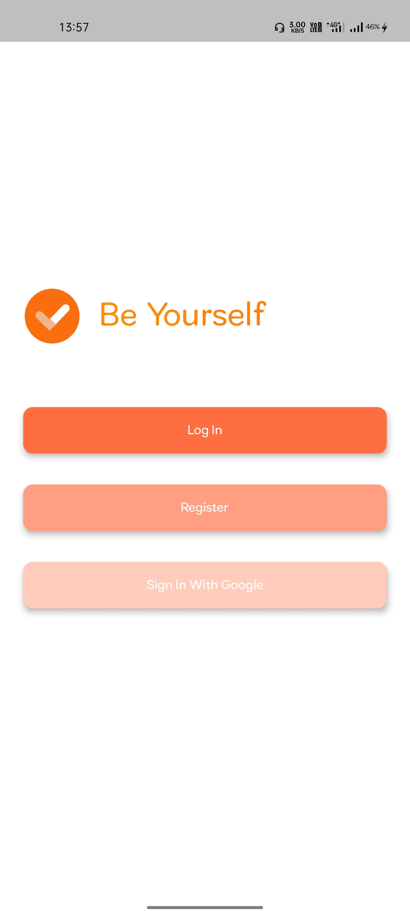
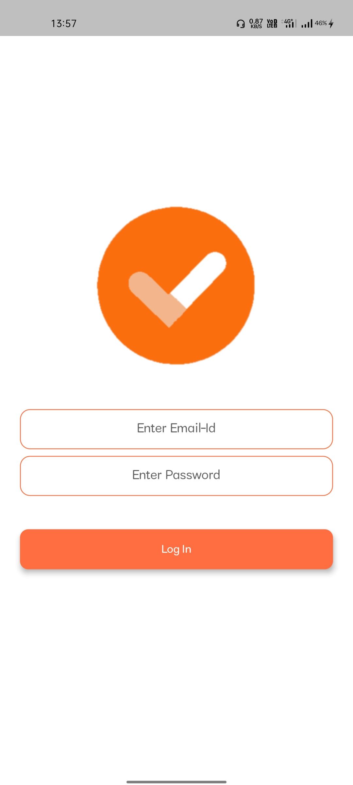
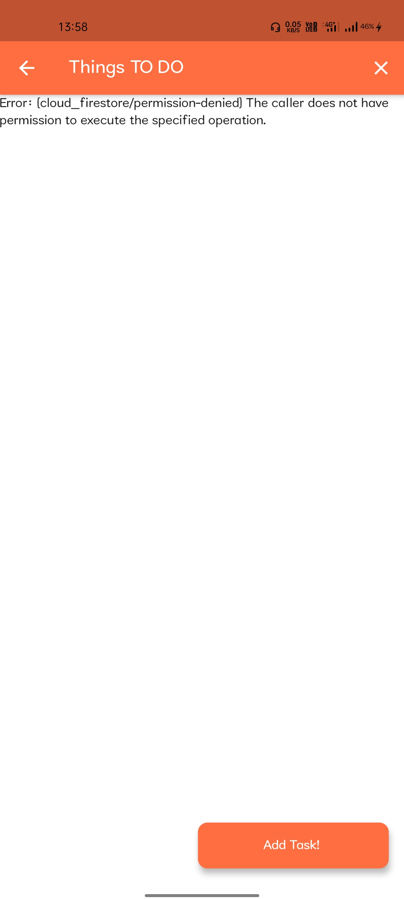
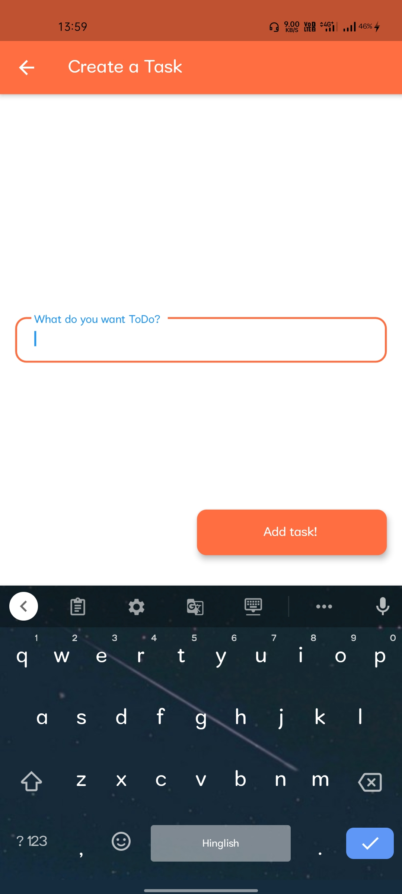

# ☑️TODO App

A simple Flutter App to add Tasks with User Authentication from Firebase.

## Features:
 - Implemented Text Animations
 - Used Firestore and Firebase Authentication
 - Realtime Updates in Firebase NoSQL Database

## Screenshots:

### TODO's for the future:
1. Implement Google Sign In
2. Implement Date and Time Picker
3. Provide Offline/Online Push Notifications regarding Tasks 

