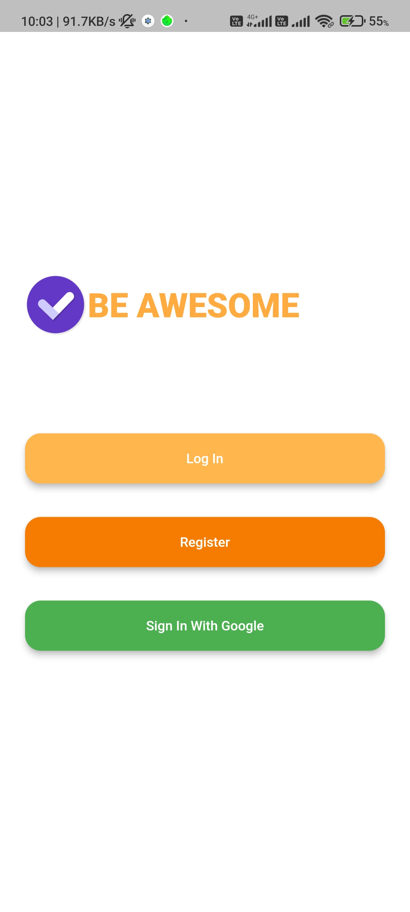
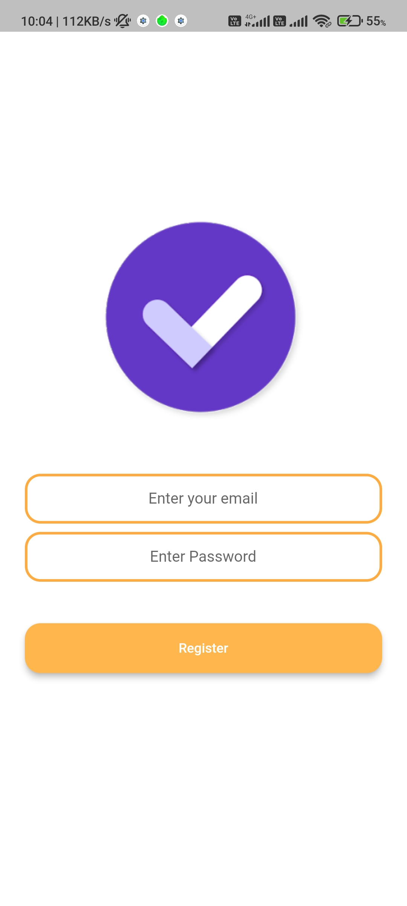
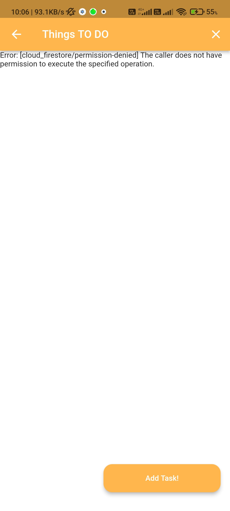
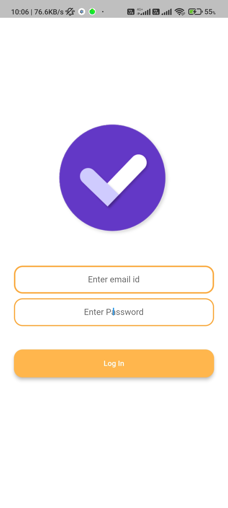

***Once you clone the repository make sure to create a Firebase app and do the relevant things (i.e. registering the app on Firebase, downloading json file from Firebase console and so on. If you take up a issue which can be solved without doing the Firebase stuff then you can commit by fixing that bug itself. I have tried to not get into the mess of setting up Firebase as much as possible for these issues.
All the Best!***

# ☑️TODO App

A simple Flutter App to add Tasks with User Authentication from Firebase.

## Features:
 - Implemented Text Animations
 - Used Firestore and Firebase Authentication
 - Realtime Updates in Firebase NoSQL Database

## Screenshots:

### TODO's for the future:
1. Implement Google Sign In
2. Implement Date and Time Picker
3. Provide Offline/Online Push Notifications regarding Tasks 

